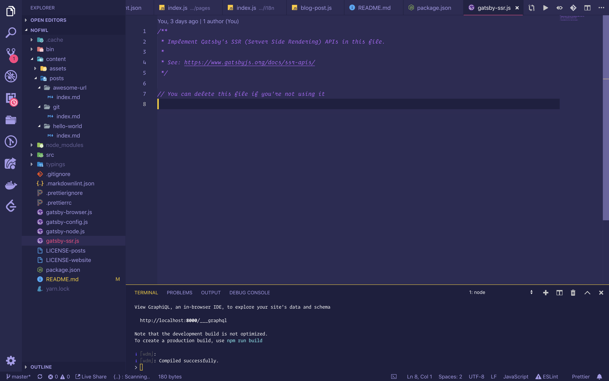

> [nofwl](https://github.com/lencx/nofwl)

## 特点

- 国际化
- 主题模式切换（白天/夜晚）
- 评论（[utterances](https://github.com/utterance/utterances)）
- 统计（Google analytics）
- 高亮代码行
- 编程语言识别，如果不存在，可自行添加（js, ts, jsx, c, bash, rust, go, ...）

## Test code languages

```js
// log
const print = console.log;
print('Hello world');
```

```rust
fn main() {
  println!("hello world");
}
```

```bash
mkdir hello
cd hello
echo hello world >> hello.txt
```

```md
# hello world

1. hello
2. world
```

```c
#include <stdio.h>

int main()
{
  printf("Hello world\n");
}
```

## Test Table

| key | value |
| --- | ----- |
| a   | 1     |
| b   | 2     |
| c   | 3     |

## Test List

- list-item-1
- list-item-2
- list-item-3

## Test image



## Test highlight code line

```js{1,3-5}
console.log(1);
console.log(2);
console.log(3);
console.log(4);
console.log(5);
console.log(6);
```