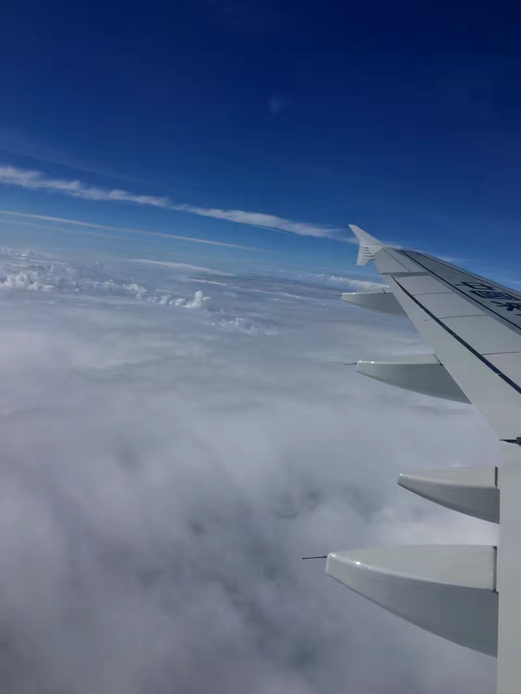

>> 2013/09/09 (from Notes)
---
> 青春代表年轻，这是资本，是犯了错可以去改，跌倒了可以再爬起来的资本。虽然年轻，但她并不代表着我们可以肆无忌惮的去挥霍她。\
> 也正是因为年轻，所以有很多的不确定因素，总是让人难以把握。\
> 外面世界的繁华，社会的种种规则，让我这个还未步入社会的少年心生胆怯。这不是逃避，而是对于未知的一种不安罢了。我就像是一只迷途的羔羊，看不到前方的路......

这是一个安宁的村落，没有都市的繁华。但她却有着自己独特吸引着我，或许这就是家的魅力吧！

“家”是一个敏感的字。

因为外面的世界再繁华，也掩盖不住内心的孤独。在外求学，离开的日子久了，才发现原来我一直是以她为中心的。

她并不高大、繁华，但每当我遇到挫折、不顺时，最先想到的就是她。

她不能给予我什么，但是她确是精神的寄托，灵魂的归宿。这种精神上的支撑，不是金钱所能够衡量的。

我是一个普通的不能再普通的少年，但因为家里的一些事情，总让母亲寄予很高的期望，或许孩子在每个母亲的眼中都是那么的不平凡吧。

月亮依旧明亮，繁星还是满天，但是此时仰望星空却是【思绪万千】，心境与小时候大相径庭。
不知是视野的开阔让自己变得成熟起来，还是都市的繁华让自己迷失了......节奏的打乱让我有点不知所措。

单纯的心也在求知的道路上不断的发生着改变，不知是喜还是忧。

记得小时候没有电视，每天下午放学后，我每天晚上最喜欢做的事就是搬张小凳子，坐在院子里，月亮将灯光照不到的地方，映得惨白，而我则是对着破旧的土房的墙壁发呆。
墙壁上那灯泡发出的那昏暗的，发黄的光会吸引来好多的飞蛾，而墙上的壁虎估计每天晚上的这个时候都是最享受的时刻。而我看壁虎捕食，抬头仰望星空也成了我儿时的回忆。想想我当时是多么的幼稚与无知，看着满天的繁星说着我将来要当一名科学家，现在当一个人独处的时候还觉得儿时的“豪言壮语”不时的在耳旁回响。
小时候的生活虽然有点傻，但是确是那样的纯粹，没有烦恼，可以盯着那破旧的土墙看几个小时，看着明月，数着繁星。一切都是那么的自然，觉得就算是天塌下来，也是大人们的事情，跟自己没什么关系。

上学，学习这些词可以说是伴着自己的成长的，甚至觉得小孩就应该去上学，是很自然，很理所当然的事情。

在我上初三时，第一次跟父母说我不想念书了。因为刚上初中时我们班有六十多个人，中途也时不时的有几个退学，我当时并没有在意。但是当到中考前两个多月时一下子又少了好多人，人数从刚来学校时的六十多个锐减到二十多个人的时候，我的心里不是那么平静了。我在放星期时就回家跟我妈说:“妈，我不想上学了！”不知道父母当时是什么心情，只是问我“你现在不上学，你能干什么，你能干了苦力活吗，能下了苦吗，一天老晒在太阳下，你行吗！”我当时沉默了......我也忘记自己当时是怎么想通的，去了学校，参加完了中考，算是上了个高中。高中的学习虽没多好，也不算虚度。

但是这一切都在上完高中后发生了改变，高考虽不是很理想，但也算是我的正常发挥了，我也觉得算是对得起自己了。

我记得当时我是满心期待的迎来了了我所谓的“大学生活”。

我跟我爸坐的是晚上12点的火车，我第一次有了心痛的感觉，我跟我爸都是站票，我爸看到旁边的青年躺在那里占着两个位置就问了一下，能不能让出一个，那个青年说不让那那种语气让我永生难忘...

早上6点下的火车，到了所谓的“学校”，我傻了眼，觉得上天跟我开了一个天大的玩笑，“一栋上世纪八九十年代的2层楼就是所谓的教室，两个水泥地的篮球场就是所谓的操场，在操场旁边还有两个新建的活动板房就是所谓的大教室”。在这大教室里上课算是让我真正的体会到了什么叫做冬冷夏热。

“大一”一年还算正常，我思想的转变是发生在“大二”，因为我发现逃课成了普遍现象，而且缺课人不在少数，我就开始在想难道那张“证”真的就那么重要，有了它真的就能有工作？学习究竟是为了什么。学习真的能够改变命运？我发现自己变得多愁善感起来了，时不时的想写点东西。还记得我上高中时最讨厌的就是作文课，尤其是怕被老师叫上去读自己的作文。我一直都觉得我对写东西是有阴影的。

##  空

我想寫點什麽，但是卻不知如何下筆，努力的想，又怎麼也理不出思緒，有點混亂...
我時常會有一種与世格格不入的感覺（也許是我太高估自己了），我常常會有一種感覺，感覺自己就是一切，又覺得自己很是渺小，在矛盾中往复...

人是怎樣的一種存在，從出生到死亡要有怎樣的經歷，才算完滿？思想賦予人的力量是偉大的（*我不懂哲學，但卻總是喜歡把一些問題複雜化去究其本質，其實我也不知道哲學是不是研究這個的。可能這衹是我所認為的，不一定對*），讓人能夠去深入的去思考一些事物。當你把一件事物反複的想時，可能你會有所發現【我當初就想過錢这種東西，錢本身是沒有什麼價值的（廢紙一張而已），它衹是一種驅使人力推動社會發展的工具罷了。我想當社會高度發達時，每個人的思想都是積極的，向上的能夠把建設社會，實現社會大衕當作一種本能時，我想錢這種東西應該就可以退出歷史的舞颱了吧（我沒看過有关与經濟方麵的書籍，可能我說的是十分的可笑与幼稚吧）】，也許事物都是如此，有著自己既定的軌跡，從產生到消亡。但是當我用衕樣的方法去思考人時，我迷茫了...

人的出現是爲了什麽，有這怎樣的軌跡，終其一生的目的又是爲了什麽？我有點混亂了... 留名千古？還是遺臭萬年？（還是爲了我所說的建設社會，實現大衕）真的衹是這些嗎？在我看來這一切都是空的，因為我覺得它們之間并沒有本質上的區別，人終將會被湮滅在浩浩蕩蕩的歷史的長河中，連一粒沙子也算不上，這也僅僅是對于我們所生活額星球而言人就這般的渺小（可能是我太過於消極了）。`當你放眼太空時，地球也不過塵埃大小罷了，在這以光年為距離，億年為時間單位的茫茫太空中，人生不過是一眨眼的事情。`人是偉大的，思想是（暫時沒想到），但是在時間与空間的面前卻是那麼的渺小与脆弱。這使我感覺不到我所存在的價值（也許根本就是一毛不值）...

也許我會一直迷茫下去（其實我也一直在不斷的給自己定位，我也很想知道自己是怎樣的一個人，別人是不是也跟我一樣啊），或許有一天我真能悟出人活著到底是爲了什麽（雖然貌似是不可能的... 所以我更期待的是有人能夠為我解惑，一起探讨。

當我用言语去表達我的思想時，我總覺得少了點什么（所寫非所想），可能是我的表達能力有限吧。既然寫不出來，就讓它永遠埋在心底吧，最起碼不会覺得空蕩蕩的。

##  人？

人是怎樣的一種存在？

人生在世不過區區幾十載，忙忙碌碌，到底是為了什麽，錢嗎？還是名聲和地位？

我搞不懂，為什麽會有人這個物種，而人的存在又是爲了什麽？？？我一直在苦苦的思索，掙扎著，百思不得解，迷茫...

在中學时代，學習，考試就是一切，考試在我看來衹不過是一種形式，它衹會讓人變得麻木，使人成為為考試而學習的工具；大學時代，算是進入了半個社會，這才讓我體會到了什麽是現實，小時候的那些想法是多麼的荒謬，天堂就好比是那鏡中花，水中月，是那樣的望不可及。

*人、人生 、命運對我來說都是很抽象的東西，我苦苦思索不得其解。從小老師就告訴我們“要好好學習，知識能夠改變命運”，我一直都很是質疑，我想不通知識与命運有何關係，日後要達到何種程度，取得怎樣的成就才算是改變了命運，我迷茫... 我不知道，我連什麽是人、什麽是人生都不知道，又何以去談命運。我發現我徹底迷茫了...*

多年來的學習並沒有讓我充實，反而讓我覺路是越走越暗，心裡是越來越空... 讓我覺得与這個世界是格格不入。

我發現我的思緒有點混亂，一些若有若無的東西時常使我睏惑，難道是我喜歡把問題複雜化，爲什麽會這樣呢，我不知道了...

最近心裡老是感覺空空的，接下來的路該何去何從... 或許老天也不知道吧。

俗话说“人为财死，鸟为食亡”。所谓的生活，就是生下来，活下去。父母生下了你，怎样活是自己的事。但现在的社会没有钱，很显然是活不下去的，要不然国家也就不会设立低保了。所以我们想要生存，想要更好的生活，不得不变的世俗。环境可以改变人，规则可以驱使人。

《空》、《人?》让我是越写越迷茫，这个世界的复杂或许只有等走出去了，闯出自己的一片天，才有自己的发言权。

>> 2014/01/25 <small>(from QQ日志)</small>
---
浑浑噩噩，日子一天天的在漫无目的中悄然溜走。大脑犹如生锈的机器，懒得或者说不敢去转动。生怕这将是一次毁灭。吃饭，睡觉玩游戏成为每天的“任务”。让人乏味，无趣。

没心没肺的的日子过久了，会使人麻木。什么都不去想，什么都不去做，我真很想对自己说一句：“你他妈的是废物吗？”可是我没有勇气。

废物或许还有被回收利用的一天，可是我呢？价值何在...

近似残废的身体托着一无是处的脑袋。不会思考，但却本能的知道饿，要吃...难道这就是“人”。

>> 2014/04/14 <small>(from QQ日志)</small>
---
不知道是不是停电的缘故，无端的从脑海里闪过好多想法，突然觉得自己好幼稚（呵呵），黑色让天气降温，随之而来的是人的（降温），最近的日子过得有点得过且过了，这样的日子过久了会使人麻木，头脑也会迟钝。

希望还来得及，我已经浪费了不少，以后不知道还有多少是属于自己的。未知并不可怕，黎明前的黑暗，让等待成为煎熬，永远不会有人知道黑暗的背后是朝阳，还是末日。

活一天就要给自己一个信念。执着总会有希望（呵呵，我都觉得是自己在安慰自己）。

曾经的的我们是那样的懵懂无知，或许正是这份无知让我们看起来都是那样的天真。但时间不会停止，人总是会长大，当学会思考时真不知道是该喜还是忧。

看多了，听多了，想多了或许就活明白了。

其实人生就像钟摆，看似只有左右两个可能，其实确实只有左右两个可能……你可以说钟摆摆动的过程中延展了无数可能，但那不是可能，只是通往可能的路径，最终你不是摆到左，就是摆到右。一切皆有可能，但所谓一切也不过或左或右两种可能，只有居中不变万万不能，除非钟摆坏掉，而那是生命静止的模样。

钟摆坏掉，生命静止，并不可怕，可怕的是精神上的空虚，这是物质所不能填补的。

内心的空虚只能用我的胡思乱想来填充了，这样最起码不会空荡荡的，让自己知道我其实还是一个人。

>> 2014/06/18 <small>(from weChat朋友圈)</small>
---
口袋就剩22块5毛钱，突然觉得自己是那样的孤独与无助，希望自己能够尽快的成长起来。
——献给年少无知的自己

>> 2014/10/07 <small>(from QQ日志)</small>
---
虽说欲望是发展的动力，但我们必须要知道：欲望既能让我们向幸福的方向发展，也会让我们向痛苦的方向发展。所以它永远是一把双刃剑。
我们因为被蚊子叮而发痒的时候，用手挠痒暂时会感到舒服；我们因为欲望而心里发痒的时候，用物质去挠痒暂时会感到幸福。但是没有欲望会更加幸福。

有限的东西，永远无法填补无限的空间。我们的欲望是无限的。而所有物质，给我们带来的感受却是有限的，所以物质不会真正的满足我们。

這是一個物慾橫流的時代，我們不得不承認。要說沒有慾望是不可能的，活下去本身就是一種慾望，所以慾望並不可怕。重要的是怎樣能讓自己無憾。這個問題我們有思考過嗎？

人生不過短短數十載，在這以光年為距離，億年為時間單位的茫茫宇宙中，百年的人生不過彈指一揮間。人終其一生的目的難道就是為了名或利？還是一種自我滿足的狀態？我們真的活明白了嗎？

夜深人靜的時候，一個人常常在想自己需要的是什麼，這是離自己最近的，也是觸手可及的。因為太虛無縹緲的東西想多了，會讓人把什麼都看得太淡了，那就不好了。失去了生活的激情，也就沒什麼意思。所以覺得做人好難，在思想与現實間來回的穿插，在人前永遠表現出一副積極樂觀的模樣。

有時候甚至在想，自己要是一花一草一物就好了，因為沒有思想，或許就不會有這麼多的煩惱。

—— 致自己

>> 2014/10/15 <small>(from weChat朋友圈)</small>
---
认识“人”，了解“人”，你就能人所不能。

>> 2015/03/31 <small>(from weChat朋友圈)</small>
---
不知不觉中，又长了一岁，也感觉到了自己身上的责任。生活我们不能去选择，但是努力总会有所改变。

>> 2015/06/01 <small>(from weChat朋友圈)</small>
---
夜里的光 \
绝望里的希望 \
成为夜里的光 \
再漫长 \
都会天亮

>> 2015/11/28 <small>(from weChat朋友圈)</small>
---
“我”是一切的根源，要想改变一切，首先要改变自己！

>> 2016/04/10 <small>(from weChat朋友圈)</small>
---
世间最好的默契，并非有人懂你的言外之意，而是懂你的欲言又止。

>> 2016/06/19 <small>(from weChat朋友圈)</small>
---
唉，失眠了，失去并不可怕，可怕的是从来都没有得到过，竟然会有种失去的感觉。人真是越活越矫情了。

>> 2016/06/28 <small>(from weChat朋友圈)</small>
---
给自己制定一份计划，大脑之所以会胡思乱想，就是因为闲的蛋疼，不想还能干嘛。智慧的大脑是不会将时间浪费在一些琐事中的。想想你这段时间的堕落，真为你感到心痛。当初的三年目标都抛诸脑后了吗？就你现在的这个样子，几年后靠什么支撑一个家，哪个女人会喜欢一个没有理想，没有担当的男人。（现在的你是个男人吗，堕落，真是堕落！！！）

骚年努力工作吧，别幻想了，当你足够优秀，强大，总会有一件衣服在合适的时间，合适的地点出现在你的面前。

>> 2016/07/10 <small>(from weChat朋友圈 - 非原创)</small>
---
有些人的通病是，容易看清楚别人，不容易看清楚自己。在别人的问题上可以斟酌到锱铢必较，而在自己的问题上却可以粗略到走马观花。一颗自私的心，自然豢养出一双自私的眼睛，一种计较的活法以及一腔热衷于背后说人是非的态度。一辈子看不上别人，换一种说法就是，从来没看清过自己。

>> 2016/07/27 <small>(from weChat朋友圈)</small>
---
云层之上万里晴空，任凭下面电闪雷鸣。只要飞的够高，就能摆脱环境的束缚。

我要找回我所失去的状态。控制好自己的心。一切才刚刚开始。

>> 2016/09/26 <small>(from weChat朋友圈)</small>
---
太满足于现状，只会坐井观天。不看看别人的NB，永远不会知道自己处在一个什么位置。

>> 2016/10/09 <small>(from weChat朋友圈)</small>
---
提升自我，只为遇见更好的那个她…

>> 2016/11/04 <small>(from weChat朋友圈)</small>
---
孤独是病，脆弱的灵魂只有经历病魔的洗礼才能一步步的强大起来！

>> 2016/11/17 <small>(from weChat朋友圈 - 非原创)</small>
---
你认真做过的事，艰辛走过的路，仔细读过的书，可能都会影响你的言行举止。不要以为做过的、走过的、读过的，都过去了，也都不复记忆，没什么作用了，其实，那些经历仍潜藏在内心和记忆深处，不由地形成你的气质、胸襟，渐渐显示出你的改变、成长或影响你终生。

>> 2016/12/26 <small>(from weChat朋友圈)</small>
---
昨天的效率很低，犯了很多习惯性的错误。就是在做一件事情的时候不能先去完成一部分，去做后续的测试。当你把整个手头上的东西都完成后，才发现后续的步骤根本行不通时，才发现自己走了好多冤枉路。
总结：当在处理新问题时，注意自己的方式方法，尽量避免习惯上认知。
//TODO
纠正自己的思维惯式，提高自己遇到新问题时的分析及处理能力。

>> 2017/01/02 <small>(from weChat朋友圈)</small>
---
回头看看自己说过的话，我这样说是不是太装逼了。截止到目前为止。空间，朋友圈，已经发了七八天的总结与心得。一个习惯的养成最快需要21天（也不知道是不是忽悠人的，现在就当是真的吧）。当这21天完成时，我将默默坚持自己的理想与追求。就不到处装逼炫耀了（我已经违反了一条重要的做人原则，感觉自己最近太高调了，这样不好）。哈哈。希望那些看到我那些乱七八糟总结的每天都能对你们有一点点的触动。因为人活一世，如果只爱钱，生活难免有些乏味。

>> 2017/01/14 <small>(from weChat朋友圈)</small>
---
不知不觉中就已过去了20天。学到了很多，但是不幸的是发现不会的更多了。原来，知道与不知道是成正比的，知道的越多，才发现不知道的也愈多。(好奇害死猫，不好奇，也许猫不会死，但那还是猫吗？。。。)

>> 2017/04/05 <small>(from weChat朋友圈)</small>
---
今天清理之前使用了差不多快两年的DELL笔记本，本以为会有好多东西都要整理出来。没想到的是，从前视若珍宝的code，各种tool，破解包，现在看来也不过就是一堆垃圾。成长似乎就是回头看从前自己，就一个傻字可以概括。（现在也似乎也明白了，能力是不需要备份的，copy的东西，总有弄丢的一天。所以要有一种方法，能让零散的知识片段形成体系。而自己真正需要的是一个索引，而不是一堆杂乱无章的片段（片段好比叶子，而体系才是真正的树，索引就好比树的节点，而我所要寻找的则是根））这导致的直接结果就是，我啥也没整理，就把系统重装了。😂（绕了一大圈，又给自己找借口了，haha...）

>> 2019年
---
2014年毕业，到现在已经差不多过去了5年。 现在回过头来看以前写的东西，毒鸡汤，吐槽，反思... 真不少，挺幼稚的😅git

>> 未完待续...